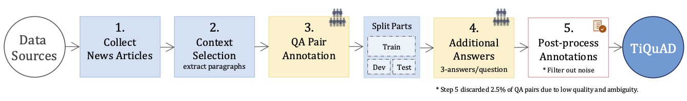
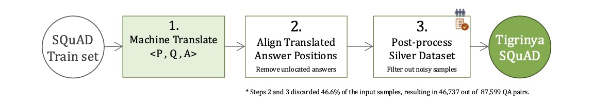

# TiQuAD: Tigrinya Question Answering Dataset

[](https://aclanthology.org/2023.acl-long.661/)
[](https://huggingface.co/datasets/fgaim/tiquad)
[](https://huggingface.co/datasets/fgaim/tigrinya-squad)
[](https://creativecommons.org/licenses/by-sa/4.0/)

This repository accompanies our ACL 2023 paper [**"Question-Answering in a Low-resourced Language: Benchmark Dataset and Models for Tigrinya"**](https://aclanthology.org/2023.acl-long.661/). Selected for the Outstanding Paper Award.

## Overview

Question-Answering (QA) has seen significant advances recently, achieving near human-level performance over some benchmarks. However, these advances focus on high-resourced languages such as English, while the task remains unexplored for most other languages, mainly due to the lack of annotated datasets. This work presents `TiQuAD`, the first human annotated QA dataset for Tigrinya, an East African language. The dataset contains 10.6K question-answer pairs (6.5K unique questions) spanning 572 paragraphs extracted from 290 news articles on various topics. The paper presents the dataset construction method, which is applicable to building similar resources for related languages.

In addition to the gold-standard TiQuAD, we develop `Tigrinya-SQuAD`, a silver dataset used as additional training resource and created by machine translating and filtering the English SQuAD v1.1 dataset.

We present comprehensive experiments and analyses of several resource-efficient approaches to QA, including monolingual, cross-lingual, and multilingual setups, along with comparisons against machine-translated silver data. Our strong baseline models reach 81% in the F1 score, while the estimated human performance is 92%, indicating that the benchmark presents a good challenge for future work.

## Datasets

### 1. TiQuAD v1

Human annotated question-answering dataset with <*Paragraph*, *Question*, *Answer*> entries.

**📥 Download** via [HuggingFace Hub](https://huggingface.co/datasets/fgaim/tiquad)

| **Split** | **Articles** | **Paragraphs** | **Questions** | **Answers** |
|-----------|--------------|----------------|---------------|-------------|
| Train     | 205          | 408            | 4,452         | 4,454       |
| Dev       | 43           | 76             | 934           | 2,805       |
| Test*     | 42           | 96             | 1,122         | 3,378       |
| **Total** | **290**      | **572**        | **6,508**     | **10,637**  |

*Data Statistics of TiQuAD: The number of Articles, Paragraphs, Questions, and Answers. The dataset is partitioned by articles.*

> **Note:** *Test set is not publicly available to maintain evaluation integrity. See [TiQuAD Test Set Access](#tiquad-test-set-access) section below.*



TiQuAD Dataset Construction Pipeline. The five-stage process includes article collection, context selection, question-answer pair annotation, additional answers annotation for evaluation sets, and quality-focused post-processing.

### 2. Tigrinya-SQuAD v1 (Extra Training Data)

The training split of the English SQuAD 1.1 dataset machine translated and filtered into Tigrinya.

**📥 Download** via [HuggingFace Hub](https://huggingface.co/datasets/fgaim/tigrinya-squad)

| **Split** | **Articles** | **Paragraphs** | **Questions** | **Answers** |
|-----------|--------------|----------------|---------------|-------------|
| Train     | 442          | 17,391         | 46,737        | 46,737      |

*Data Statistics of Tigrinya-SQuAD: The number of Articles, Paragraphs, Questions, and Answers in the Tigrinya translation of SQuAD v1.1 training set.*



## Loading TiQuAD and Tigrinya-SQuAD Datasets

**TiQuAD dataset:**

```python
from datasets import load_dataset

# Load TiQuAD
tiquad = load_dataset("fgaim/tiquad", trust_remote_code=True)
print(tiquad)
```

Output:

```text
DatasetDict({
    train: Dataset({
        features: ['id', 'title', 'context', 'question', 'answers'],
        num_rows: 4452
    })
    validation: Dataset({
        features: ['id', 'title', 'context', 'question', 'answers'],
        num_rows: 934
    })
})
```

**Tigrinya-SQuAD dataset:**

```python
from datasets import load_dataset

# Load Tigrinya-SQuAD
tigrinya_squad = load_dataset("fgaim/tigrinya-squad", trust_remote_code=True)
print(tigrinya_squad)
```

Output:

```text
DatasetDict({
    train: Dataset({
        features: ['id', 'title', 'context', 'question', 'answers'],
        num_rows: 46737
    })
})
```

**A sample entry from TiQuAD validation set:**

```json
{
    "id": "5dda7d3e-f76f-4500-a3af-07648a1afa51",
    "title": "ሃብቶም ክብረኣብ (ሞጀ)",
    "context": "ሃብቶም ክብረኣብ (ሞጀ)\nሞጀ ኣብ 80’ታትን ኣብ ፈለማ 90’ታትን ካብቶም ናይ ክለብ ኣልታሕሪር ንፉዓት ተኸላኸልቲ ነይሩ፣ ብድሕሪ’ዚ’ውን ኣብ ውድድራት ሓይልታት ምክልኻል ንንውሕ ዝበለ ዓመታት ከም ኣሰልጣኒ ክለብ በኒፈር ኮይኑ ዝነጥፍ ዘሎ ገዲም ተጻዋታይን ኣሰልጣንን’ዩ። ምሉእ ስሙ ሃብቶም ክብርኣብ (ሞጀ) እዩ። ሞጀ ብ1968 ኣብ ኣስመራ ተወሊዱ ዓብዩ። ንሱ ካብ ንኡስ ዕድሚኡ ብኩዕሶ ጨርቂ ጸወታ ጀሚሩ። ብድሕሪኡ ብደረጃ ምምሕዳር ኣብ ዝካየድ ዝነበረ ናይ ‘ቀበሌ’ ጸወታታት ምስ ጸሓይ በርቂ ምስ እትበሃል ጋንታ ተጻዊቱ። ኣብ 1987 ምስ ዳህላክ እትበሃል ዝነበረት ጋንታ ንሓደ ዓመት ድሕሪ ምጽዋቱ ከኣ ኣብ መወዳእታ ወርሒ 1987 ናብ ጋንታ ፖሊስ (ናይ ሎሚ ኣልታሕሪር) ብምጽንባር ክሳብ 1988 ተጻዊቱ። ምስታ ናይ ቅድሚ ናጽነት ጋንታ ፖሊስ ኣብ ዝተጻወተሉ ሰለስተ ዓመታት ከኣ ዝተፈላለየ ዓወታት ተጐናጺፉ ዋናጩ ከልዕል በቒዑ’ዩ። ድሕሪ ናጽነት ስም ክለቡ ኣልታሕሪር ምስ ተቐየረ፣ ሞጀ ናይታ ክለብ ተጻዋታይ ኮይኑ ውድድሩ ቀጺሉ። ኣብ መጀመርታ ናጽነት (1991) ኣብ ዝተኻየደ ናይ ፋልማይ ዋንጫ ስውኣት መን ዓተረ ውድድር ሞጀ ምስ ክለቡ ኣልታሕሪር ዋንጫ ከልዕል በቒዑ። ብዘይካ’ዚ ኣብ 1992 ብብሉጻት ተጻወትቲ ተተኽቲኻ ዝነበረት ኣልታሕሪር ናይ ፋልማይ ዋንጫ ናጽነት ከምኡ’ውን ሻምፕዮን ክትከውን ከላ ሞጀ ኣባል’ታ ጋንታ ነይሩ። ምስ ክለብ ኣልታሕሪር ፍቕርን ሕውነትን ዝመልኦ ምቁር ናይ ጸወታ ዘመን ከም ዘሕለፈ ዝጠቅስ ሞጀ፣ ምስ ኣልታሕሪር ናብ ከም ሱዳንን ኢትዮጵያን ዝኣመሰላ ሃገራት ብምጋሽ ኣህጉራዊ ጸወታታት’ውን ኣካይዱ’ዩ።",
    "question": "ኣልታሕሪር ናይ ቅድም ስማ እንታይ ኔሩ?",
    "answers": {"text": ["ፖሊስ", "ፖሊስ", "ጋንታ ፖሊስ"], "answer_start": [414, 414, 410]},
}
```

> **Note:** Samples in the `validation` and `test` sets of TiQuAD have up to three answers labeled by different annotators.

## TiQuAD Test Set Access

To maintain evaluation integrity and avoid data contamination, **the TiQuAD test set is not publicly available**.

**Researchers** looking to access the test set for evaluation purpose, please email the first author of the paper, with the following details:

- **Subject**: TiQuAD Test Set Request  
- Your full name and affiliation
- Research purpose and usage plan
- Acknowledgment that the dataset will be used for evaluation only

We review requests to ensure legitimate research use while maintaining benchmark integrity.

## Experimental Results

### Pre-trained Language Models

| **Model** | **Layers** | **AH** | **Params** | **Lang.** | **PT Tigrinya** |
|-----------|------------|----------------|----------------|---------------|------------------|
| [tielectra-small](https://huggingface.co/fgaim/tielectra-small) | 12 | 4 | 14M | 1 | yes |
| [tiroberta-base](https://huggingface.co/fgaim/tiroberta-base) | 12 | 12 | 125M | 1 | yes |
| [afriberta_base](https://huggingface.co/castorini/afriberta_base) | 8 | 6 | 112M | 11 | yes |
| [xlm-roberta-base](https://huggingface.co/FacebookAI/xlm-roberta-base) | 12 | 12 | 278M | 100 | no |
| [xlm-roberta-large](https://huggingface.co/FacebookAI/xlm-roberta-large) | 24 | 16 | 560M | 100 | no |

### Training Datasets

- **MT**: Tigrinya-SQuAD (Machine Translated SQuAD v1.1 train set) — *Tigrinya*
- **Native**: TiQuAD train set — *Tigrinya*  
- **SQuAD**: SQuAD v1.1 train set — *English*

### Results of Models and Mix of Dataset

```text
                                                            ╭───────────────────┬─────────────────╮
╭────┬─────────────────┬───────────────────┬────────┬───────┤    TiQuAD Dev     │  TiQuAD Test    │
│    │ Dataset         │ Model             │ Epochs │ Batch │   EM    │   F1    │  EM    │  F1    │
├────┼─────────────────┼───────────────────┼────────┼───────┼─────────┼─────────┼────────┼────────┤
│  1 │ MT              │ tielectra-small   │      3 │    16 │   38.54 │   46.04 │  39.25 │  48.36 │
│  2 │ MT              │ tiroberta-base    │      3 │    16 │   48.5  │   56.39 │  48.17 │  58.81 │
│  3 │ MT              │ afriberta_base    │      3 │    16 │   40.36 │   48.72 │  40.68 │  52.96 │
│  4 │ MT              │ xlm-roberta-base  │      3 │    16 │   51.71 │   59.64 │  53.17 │  62.61 │
│  5 │ MT              │ xlm-roberta-large │      3 │    16 │   59.85 │   67.06 │  61.55 │  70.85 │
│  6 │ Native          │ tielectra-small   │      5 │     8 │   36.19 │   43.06 │  28.81 │  37    │
│  7 │ Native          │ tiroberta-base    │      5 │     8 │   56.21 │   64.36 │  53.08 │  61.82 │
│  8 │ Native          │ afriberta_base    │      5 │     8 │   38.01 │   44.85 │  35.06 │  44.24 │
│  9 │ Native          │ xlm-roberta-base  │      5 │     8 │   56.53 │   65.37 │  55.75 │  65.49 │
│ 10 │ Native          │ xlm-roberta-large │      5 │     8 │   63.17 │   71.32 │  64.94 │  72.62 │
│ 11 │ MT+Native       │ tielectra-small   │      3 │    16 │   46.36 │   53.6  │  47.46 │  56.64 │
│ 12 │ MT+Native       │ tiroberta-base    │      3 │    16 │   62.42 │   70.12 │  62.18 │  70.42 │
│ 13 │ MT+Native       │ afriberta_base    │      3 │    16 │   52.68 │   59.38 │  47.37 │  58.35 │
│ 14 │ MT+Native       │ xlm-roberta-base  │      3 │    16 │   61.99 │   70.44 │  64.76 │  73.53 │
│ 15 │ MT+Native       │ xlm-roberta-large │      3 │    16 │   70.88 │   77.96 │  74.67 │  82.31 │
│ 16 │ SQuAD           │ tielectra-small   │      3 │    16 │    9.85 │   20.91 │   9.81 │  20.41 │
│ 17 │ SQuAD           │ tiroberta-base    │      3 │    16 │   10.71 │   20.88 │  10.88 │  20.69 │
│ 18 │ SQuAD           │ afriberta_base    │      3 │    16 │   20.24 │   32.05 │  20.52 │  32.95 │
│ 19 │ SQuAD           │ xlm-roberta-base  │      3 │    16 │   17.99 │   27.81 │  22.66 │  34.44 │
│ 20 │ SQuAD           │ xlm-roberta-large │      3 │    16 │   29.12 │   40.26 │  34.7  │  43.96 │
│ 21 │ SQuAD+MT        │ tielectra-small   │      3 │    16 │   37.69 │   46.06 │  39.07 │  49.07 │
│ 22 │ SQuAD+MT        │ tiroberta-base    │      3 │    16 │   51.28 │   59.25 │  51.12 │  60.75 │
│ 23 │ SQuAD+MT        │ afriberta_base    │      3 │    16 │   44.33 │   51.43 │  45.58 │  56.36 │
│ 24 │ SQuAD+MT        │ xlm-roberta-base  │      3 │    16 │   52.89 │   61.06 │  57.36 │  66.37 │
│ 25 │ SQuAD+MT        │ xlm-roberta-large │      3 │    16 │   61.03 │   67.75 │  61.91 │  71.05 │
│ 26 │ SQuAD+Native    │ tielectra-small   │      3 │    16 │   33.73 │   41.51 │  32.74 │  40.53 │
│ 27 │ SQuAD+Native    │ tiroberta-base    │      3 │    16 │   57.07 │   65.75 │  59.05 │  67.3  │
│ 28 │ SQuAD+Native    │ afriberta_base    │      3 │    16 │   51.93 │   59.66 │  51.38 │  62.13 │
│ 29 │ SQuAD+Native    │ xlm-roberta-base  │      3 │    16 │   62.42 │   69.95 │  63.07 │  71.76 │
│ 30 │ SQuAD+Native    │ xlm-roberta-large │      3 │    16 │   67.24 │   76.19 │  71.54 │  78.39 │
│ 31 │ SQuAD+MT+Native │ tielectra-small   │      3 │    16 │   45.72 │   53.4  │  47.73 │  57.1  │
│ 32 │ SQuAD+MT+Native │ tiroberta-base    │      3 │    16 │   65.2  │   71.88 │  62.53 │  71.08 │
│ 33 │ SQuAD+MT+Native │ afriberta_base    │      3 │    16 │   51.93 │   59.47 │  53.26 │  63.22 │
│ 34 │ SQuAD+MT+Native │ xlm-roberta-base  │      3 │    16 │   64.78 │   72.8  │  68.06 │  76.58 │
│ 35 │ SQuAD+MT+Native │ xlm-roberta-large │      3 │    16 │   72.59 │   79.66 │  74.13 │  81.39 │
╰────┴─────────────────┴───────────────────┴────────┴───────┴─────────┴─────────┴────────┴────────╯
```

The experiments on xlm-roberta-large were added after the paper was published. It outperforms other models mainly due to its larger size (parameters), showing successful transfer capability of fine-tuned multilingual models with minimal or zero exposure to the target language during pre-training.

## TiQuAD Evaluation

We provide the official evaluation script `evaluate-tiquad.py` for computing TiQuAD benchmark scores. The script supports evaluation against both the HuggingFace dataset and local JSON files. Install dependencies by running `pip install datasets numpy`.

The script report the following metrics:

- **Exact Match (EM)**: Percentage of predictions that match ground truth exactly
- **Token-level F1**: F1 score computed over tokens
- **Multi-reference handling**: Max score across multiple reference answers

### Predictions File Format

Your predictions file should be a JSON file with question IDs as keys and predicted answer texts as values:

```json
{
  "5dda7d3e-...": "ጋንታ ፖሊስ",
  ...
}
```

### Usage Examples

```bash
# Evaluate against HuggingFace dataset (specific split)
python evaluate-tiquad.py predictions.json --use-hf-dataset --split validation

# Evaluate against a local JSON file (TiQuAD/SQuAD format)
python evaluate-tiquad.py predictions.json --eval-set-path eval-set-v1.json
```

Add `--verbose` options to print out more details.

**Sample Output:**

```text
Loading predictions from: predictions.json
Loading validation set from HF dataset...
Computing evaluation scores...

===================================
TiQuAD EVALUATION RESULTS
===================================
Exact Match (EM): 0.6542 (65.42%)
F1 Score:         0.7321 (73.21%)
Questions evaluated: 934
===================================
```

## Citation

This work can be cited as follows:

```bibtex
@inproceedings{gaim-etal-2023-tiquad,
    title = "Question-Answering in a Low-resourced Language: Benchmark Dataset and Models for {T}igrinya",
    author = "Fitsum Gaim and Wonsuk Yang and Hancheol Park and Jong C. Park",
    booktitle = "Proceedings of the 61st Annual Meeting of the Association for Computational Linguistics (Volume 1: Long Papers)",
    month = jul,
    year = "2023",
    address = "Toronto, Canada",
    publisher = "Association for Computational Linguistics",
    url = "https://aclanthology.org/2023.acl-long.661",
    pages = "11857--11870",
}
```

## Acknowledgments

- Native Tigrinya speakers who contributed to the annotation process of TiQuAD
- Hadas Ertra newspaper and Eritrean Ministry of Information ([shabait.com](https://shabait.com)) for source articles
- The SQuAD team for the foundational work used as source for Tigrinya-SQuAD.

## License

This work is licensed under a [Creative Commons Attribution-ShareAlike 4.0 International License](https://creativecommons.org/licenses/by-sa/4.0/).

<a rel="license" href="http://creativecommons.org/licenses/by-sa/4.0/"></a>
